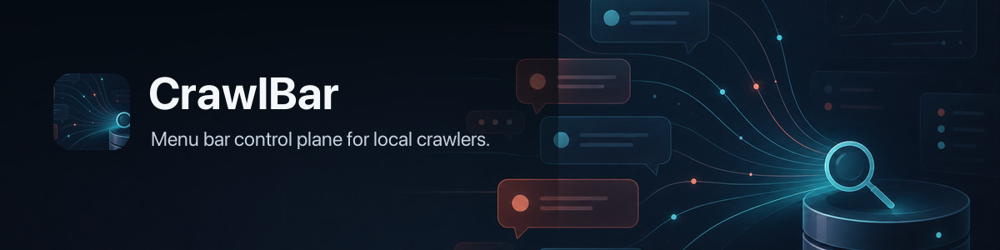
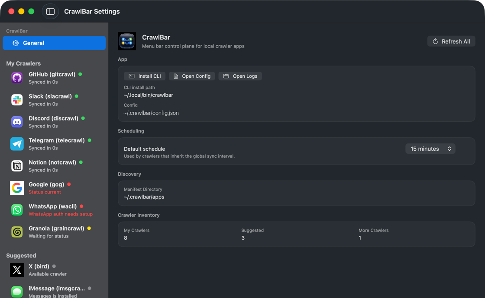

# CrawlBar 🕷️ — One menu bar for your local crawlers

[](https://github.com/openclaw/crawlbar/actions/workflows/ci.yml)
[](https://github.com/openclaw/crawlbar/releases/latest)
[](https://www.apple.com/macos/)
[](LICENSE)
[](https://github.com/openclaw/homebrew-tap)



CrawlBar is a native macOS menu bar app and CLI for operating local source crawlers. It discovers crawler manifests, shows status and freshness, runs supported actions, and keeps local configuration and redacted action logs in one place.



## Install

Install the notarized app and its `crawlbar` CLI with Homebrew:

```sh
brew install openclaw/tap/crawlbar
```

CrawlBar requires macOS 14 or newer. You can also download the notarized universal build from [GitHub Releases](https://github.com/openclaw/crawlbar/releases/latest).

## Quick start

```sh
open "$(brew --prefix crawlbar)/CrawlBar.app"
crawlbar apps
crawlbar config validate
```

The app appears in the menu bar. Open its menu to inspect crawler state, refresh all sources, or open Settings for per-crawler actions and configuration.

## Crawler discovery

CrawlBar ships manifests for GitHub, Slack, Discord, Telegram, iMessage, Apple Photos, WeChat, Notion, Google, WhatsApp, X, and Granola crawler tools. Each manifest describes the executable, supported actions, configuration fields, paths, and privacy metadata; the UI only exposes capabilities that the manifest provides.

Additional crawlers can install a manifest at `~/.crawlbar/apps/*.json` without changing CrawlBar. The [control protocol](docs/control-protocol.md) documents the manifest schema, status normalization, command contract, remote execution, and privacy rules.

## Actions and remote crawlers

Common crawler capabilities include status, refresh, doctor, search, and local archive actions. GitHub and Discord crawlers can also expose Cloudflare remote-archive status and compressed SQLite publish actions when their installed CLIs advertise those capabilities.

Google, WhatsApp, and X crawler commands can run locally or over SSH. Remote mode resolves the crawler binary on the configured host while keeping the same status and action model in CrawlBar.

## CLI and automation

The installed app includes a `crawlbar` CLI. SwiftPM names the development executable `crawlbarctl` so it does not collide with the `CrawlBar` app binary on case-insensitive filesystems.

| Task | Command |
|---|---|
| List discovered crawlers | `crawlbar apps [--json]` |
| Read normalized status | `crawlbar status --app <id\|all> [--json]` |
| Run a crawler operation | `crawlbar doctor\|refresh --app <id> [--json]` |
| Inspect or validate config | `crawlbar config path\|validate` |
| Show all commands | `crawlbar --help` |

See the [CLI reference](docs/cli.md) for queries, actions, backups, configuration, development binary overrides, and JSON output.

## Configuration and privacy

CrawlBar stores its main configuration at `~/.crawlbar/config.json`, external manifests under `~/.crawlbar/apps`, and action logs under `~/.crawlbar/logs`. Configuration and logs use private file permissions.

Crawler command output is redacted before it reaches the UI, CLI response, or action log. Source crawlers continue to own their archives, authentication, parsing, search, and source-specific privacy policy.

## Development

The package requires Swift 6.1 or newer.

```sh
swift build
swift run crawlbar-selftest
Scripts/package_app.sh
codesign --verify --deep --strict --verbose=2 dist/CrawlBar.app
```

The packaged app is written to `dist/CrawlBar.app`. See the [development and packaging guide](docs/development.md) for signing and release-build details. Architecture and UI conventions live in the [quality rubric](docs/quality-rubric.md) and [UI rules](docs/ui-rules.md).

## License

MIT. See [LICENSE](LICENSE).
